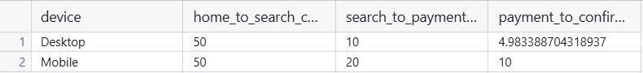

# SQL Project: Exploring E-commerce Website Analysis with Funnels & Churning Rate

## Project Overview

This sql project aims to explore the churning and funnel rates throughout an E-commerce Website and explore the impact that gender and device type have on them. The project uses a dataset of different tables to explore the rates and provied insight onto how producers can increase their sales rates. The primary question addressed is:

- **How do users interact with an e-commerce website, and does their device type (Desktop vs. Mobile) or gender influence their patterns and conversion rates? Additionally, what is the funnel rate for users moving through the website's pages?**

## Data Schema:

The [dataset](https://www.kaggle.com/datasets/aerodinamicc/ecommerce-website-funnel-analysis/data) used in this project tracks user interactions across multiple pages and contains the following attributes:

- **user_id**: identifier for each user.
- **device**: device the user is on.
- **sex**: gender of user
- **page**: a series of pages the user visits, including as `home_page`, `search_page`, `payment_page`, and `payment_confirmation_page`. These are null if user did not reach the page.

## SQL Techniques

This project utilizes various SQL techniques to analyze the data:

- **Aggregation Functions**: for tallying estimates.
- **Conditional Grouping**: to group up certain categories.
- **Subqueries and Nestested Queries**: to help filter comples queries and aggregations.
- **Joins and Grouping**: for creating and organizing data.
- **Pivoting Data**: Help make data easier to compare side by side.
- **Null Handeling**: use checks for null to combat missing by design values

<br><br>

## Analysis Questions:

### 1. **What is the most common device type used for each page?**

**Query**: This query identifies the number that reached each page and groups it by device used.

```sql
SELECT device,
    COUNT(CASE WHEN home_page IS NOT NULL THEN 1 END) AS home_page_visits,
    COUNT(CASE WHEN search_page IS NOT NULL THEN 1 END) AS search_page_visits,
    COUNT(CASE WHEN payment_page IS NOT NULL THEN 1 END) AS payment_page_visits,
    COUNT(CASE WHEN payment_confirmation_page IS NOT NULL THEN 1 END) AS payment_confirmation_page_visits
FROM full_table
GROUP BY device
ORDER BY device
```


**Inight**: Looking at this query, we can tell that desktop users are more likley to reach the home page but less likely to complete a purchase overall.

***

### 2. **Which gender, if any, has higher rates of visiting and making purchases?**

This query analyzes how different gender influence how a user progresses through the website.

```sql
SELECT 
    gender,
    COUNT(CASE WHEN home_page IS NOT NULL THEN user_id END) AS total_home_visitors,
    COUNT(CASE WHEN search_page IS NOT NULL THEN user_id END) AS search_visitors,
    COUNT(CASE WHEN payment_page IS NOT NULL THEN user_id END) AS payment_visitors,
    COUNT(CASE WHEN payment_confirmation_page IS NOT NULL THEN user_id END) AS completed_purchases
FROM full_table
GROUP BY gender;
```


**Insight**: Through this, we can see that both genders visit the page and make purchases at the same rate.

**Significance**: Given this observation, we can conclude that it may be beneficial advertise our produce on gender neutral websites or places both genders would see it.

***

### 3. **What is the funnel conversion rate from home page to payment confirmation page?**

This query calculates the conversion rate of users from one page to the next page.

```sql
-- alternative way to do counting 
WITH funnel AS (
    SELECT DISTINCT user_id
    FROM full_table
    WHERE home_page = 'home_page'
),
search_page_visitors AS (
    SELECT DISTINCT user_id
    FROM full_table
    WHERE search_page = 'search_page'
),
payment_page_visitors AS (
    SELECT DISTINCT user_id
    FROM full_table
    WHERE payment_page = 'payment_page'
),
payment_confirmation_visitors AS (
    SELECT DISTINCT user_id
    FROM full_table
    WHERE payment_confirmation_page = 'payment_confirmation_page'
)
SELECT 
    -- conversion rates for each
    (SELECT COUNT(*) FROM search_page_visitors) * 100.0 / (SELECT COUNT(*) FROM funnel) AS home_to_search_conversion_rate,
    (SELECT COUNT(*) FROM payment_page_visitors) * 100.0 / (SELECT COUNT(*) FROM search_page_visitors) AS search_to_payment_conversion_rate,
    (SELECT COUNT(*) FROM payment_confirmation_visitors) * 100.0 / (SELECT COUNT(*) FROM payment_page_visitors) AS payment_to_confirmation_conversion_rate
FROM funnel
LIMIT 1;
```


**Insight**: Through this query, we can see that 50% of users move from the home to the search page indicating that they either are interested because of the search page or that the search page is the reason they come. Additionally, only 13% move from the search page to the payment page and 7% of them move on to purchasing. This indicates that maybe our search page is not optimized to find the best resources or that it doesn't draw our users in.

***

### 4. **How do device types (Desktop vs. Mobile) affect conversion rates across the funnel?**

This query examines how device type impacts the conversion rates from page to page in the funnel.

```sql
SELECT device,
    -- home to search converstion
    (COUNT(CASE WHEN search_page IS NOT NULL THEN 1 END) * 100.0) / 
    NULLIF(COUNT(CASE WHEN home_page IS NOT NULL THEN 1 END), 0) AS home_to_search_conversion_rate,
    -- search to payment Conversion
    (COUNT(CASE WHEN payment_page IS NOT NULL THEN 1 END) * 100.0) / 
    NULLIF(COUNT(CASE WHEN search_page IS NOT NULL THEN 1 END), 0) AS search_to_payment_conversion_rate,
    -- payment to confirmation conversion
    (COUNT(CASE WHEN payment_confirmation_page IS NOT NULL THEN 1 END) * 100.0) / 
    NULLIF(COUNT(CASE WHEN payment_page IS NOT NULL THEN 1 END), 0) AS payment_to_confirmation_conversion_rate
FROM full_table
GROUP BY device;
```



**Insight**: This query shows us that mobile users are more than 2x as likely to reach the payment page and from there 2x as likely to complete a purchase than users on a Desktop. This equates to a 4x chance to purchase a product.

**Significance**: When paired with the knowledge you get twice as many users to view the the pages on the desktop, we can see that we still get more purchases from the mobile users. This should be our target audience.

***

### 5. **Which gender makes the most mobile purchaes?**

This query examines how gender impacts the number of page visits in mobile devices.

```sql
SELECT gender,
    COUNT(CASE WHEN home_page IS NOT NULL THEN 1 END) AS home_page_visits,
    COUNT(CASE WHEN search_page IS NOT NULL THEN 1 END) AS search_page_visits,
    COUNT(CASE WHEN payment_page IS NOT NULL THEN 1 END) AS payment_page_visits,
    COUNT(CASE WHEN payment_confirmation_page IS NOT NULL THEN 1 END) AS payment_confirmation_page_visits
FROM full_table
WHERE device = 'Mobile'
GROUP BY gender;
```


**Insight**: With this information, we can see that the men and women share the same number of page visits but women have ~20% more payment confirmation.

**Significance**: This tells us that we may want to target women more than men or place it in a place where both genders will visit.

***

## Conclusion:

This analysis reveals a few patterns that can help us guide this E-commerce buisness into a more successful product. 

- Shift to Mobile
The most dramatic observation was the percentage of users who made a purchase compared to Desktop users. Despite having twice as few customers as the desktop version, mobile users have a 4x multipled chance of making a purchase, it is evident that a push to mobile would be a necessary strategy that would lead to an increase in overall sales. 

- Gender Analysis
When comparing how different genders view the product, especially on mobile devices, we can see that both genders purchase the product relatively evenly with a ~20% higher purchase rate with females. This can be a sign that our product might benefit from being advertised in places where more females are likely to view it but both genders visit.

- Funnel Analysis
When addressing the conversion funnel rate, we can see a notable drop off from users when navigating from the search page to the payment page with only 13% moving forward. This might point to some issues with the search page, possibily in exploring products or having trouble navigating the site in general. Some possible ways to increase this would be to improve search functionality by adding more related searches or adding in product features. Another big issue is in moving from payment_page to confimation_payment with only 7% reaching it. With a nationwide 30%, we are severely off and would benefit from reworking the conformation page layout by making it more user friendly.

By using these techniques we would be able to increase the amount of purchases we attain from users and have a better user interaction with our product overall.

**This project serves to demonstrates my SQL skills by analyzing data and funnel rates, as well as an in-depth understanding of user behavior segmented by device type and gender.**
